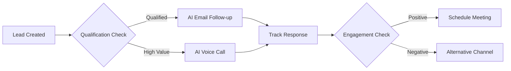

<div align="center">

# 🚀 Ultimate Sales CRM Platform

[](https://semver.org)
[](https://opensource.org/licenses/MIT)
[](http://makeapullrequest.com)
[](https://elevenlabs.io)

### Your All-in-One AI-Enhanced Sales Management Solution
*Streamline your sales process with AI-powered automation and intelligent follow-ups*

[Getting Started](#getting-started) •
[Features](#features) •
[Documentation](#documentation) •
[Support](#support)


</div>

## ✨ Highlights

- 🏢 **Multi-Workspace Support** - Create and manage multiple workspaces
- 👥 **Team Collaboration** - Invite members and assign roles
- 🎯 **Lead Management** - Track and nurture leads effectively
- 🔌 **Webhook Integration** - Receive leads from multiple sources
- 🤖 **AI-Powered Follow-ups** - Automated email and call management
- 🔄 **Flow Actions** - Custom automation workflows
- 🔐 **Advanced Permissions** - Granular access control
- 📊 **Analytics Dashboard** - Real-time performance metrics

## Upcoming Features
## 🤖 AI Integration Features
### 🗣️ ElevenLabs Voice AI Integration
- **Automated Call Follow-ups**
  ```markdown
  - Natural voice synthesis
  - Multi-language support
  - Custom voice cloning
  - Sentiment analysis
  - Real-time call transcription
  ```

### 📧 AI Email Automation
- **Smart Email Follow-ups**
  ```markdown
  - Context-aware responses
  - Personalized templates
  - A/B testing
  - Sentiment analysis
  - Best time prediction
  ```

## 🔄 Flow Actions

### Workflow Automation


### Available Flow Actions
- **Lead Processing**
  ```markdown
  - Lead scoring
  - Data enrichment
  - Duplicate detection
  - Territory assignment
  ```

- **Communication Flows**
  ```markdown
  - Email sequences
  - SMS campaigns
  - Voice calls
  - Social media engagement
  ```

- **Follow-up Logic**
  ```markdown
  - Time-based triggers
  - Behavior-based actions
  - Multi-channel coordination
  - A/B testing
  ```

[Previous sections remain the same...]

## 🎯 Core Features

### 🏢 Workspace Management
[Previous content remains the same...]

### 👥 User & Access Management
[Previous content remains the same...]

### 📈 Lead Management
[Previous content remains the same...]

### 🔌 Webhook System
[Previous content remains the same...]

## ⚡ AI Configuration

### Voice AI Setup
```javascript
{
  "elevenlabs": {
    "api_key": "your_elevenlabs_api_key",
    "voice_id": "custom_voice_id",
    "settings": {
      "stability": 0.8,
      "similarity_boost": 0.7
    }
  }
}
```

### Email AI Configuration
```javascript
{
  "email_ai": {
    "templates": ["follow_up", "meeting_request"],
    "tone": "professional",
    "language": "auto_detect",
    "max_follow_ups": 3
  }
}
```

## 📊 Analytics & AI Insights

| Metric | Description |
|--------|-------------|
| 🎯 Response Rate | AI email campaign performance |
| 📞 Call Success | Voice AI interaction success rate |
| 💬 Sentiment Score | Customer response sentiment analysis |
| ⏱️ Best Time | AI-predicted optimal contact times |

[Previous sections remain the same...]

## 🔄 Updates

We regularly ship new features and AI improvements. Stay updated:

- Follow us on [Twitter](https:)
- Join our [Slack Community](https:)
- Subscribe to our [Newsletter](https:)

---

<div align="center">

### Made with ❤️ and 🤖 for sales teams worldwide

[Website](https:) • 
[Documentation](https:) • 
[GitHub](https:)

</div>
